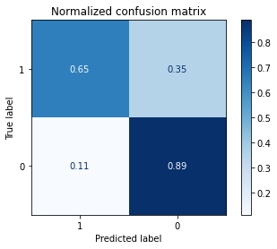

# A comparative study in Diabetes Diagnosis through Multilayer Perceptron and Support Vector Machine

## Summary

Early diagnosis and treatment of diabetes are essential to avoid complications such as blindness, kidney failure, heart attacks, stroke and lower limb amputation. In this work, we compared and critically evaluated the use of Multilayer Perceptron (MLP) and Support Vector Machine (SVM) to aid the diagnosis of diabetes using the [Pima Indian Diabetes database](https://www.kaggle.com/uciml/pima-indians-diabetes-database). PyTorch and Scikit-learn packages were used to build the models. 

Multilayer Perceptron (MLP) and Support Vector Machine (SVM) algorithms yielded similar test AUCs and accuracies on the Pima Indian Diabetes dataset. MLP’s higher specificity (true negative rate) of 89% compared to SVM (78%) (Figures 1-3) makes MLP more suitable for practical use, as there is a high cost associated with the incorrect classification of a large number of non-diabetes patients.

Figure 1. The bottom right of the normalised confusion matrix of the optimised Support Vector Machine (SVM) indicated it has a specificity of 78%.

Figure 2. The normalised confusion matrix of the optimised Multilayer Perceptron (MLP) indicated it has a higher specificity (89%) than Support Vector Machine (SVM).

Figure 3. The ROC revealed Support Vector Machine (SVM) algorithm displayed a slightly higher sensitivity than Multilayer Perceptron (MLP) algorithm. The optimal false positive rate and true positive rate for SVM (28.0%, 77.8%) and MLP (35.0%, 88.9%) are indicated with a green dot and a blue dot respectively. 

## Resources

The full report can be accessed [here](./Bona_Chow_Diabetes_Report.pdf).

[Diabetes-Modelling-Final.ipynb](./Diabetes-Modelling-Final.ipynb) contains the Python codes used to construct, evaluate and compare optimised Multilayer Perceptron and Support Vector Machine models.

[Diabetes-Preprocessing.ipynb](./Diabetes-Preprocessing.ipynb) includes the details of pre-processing and exploration of the dataset.

